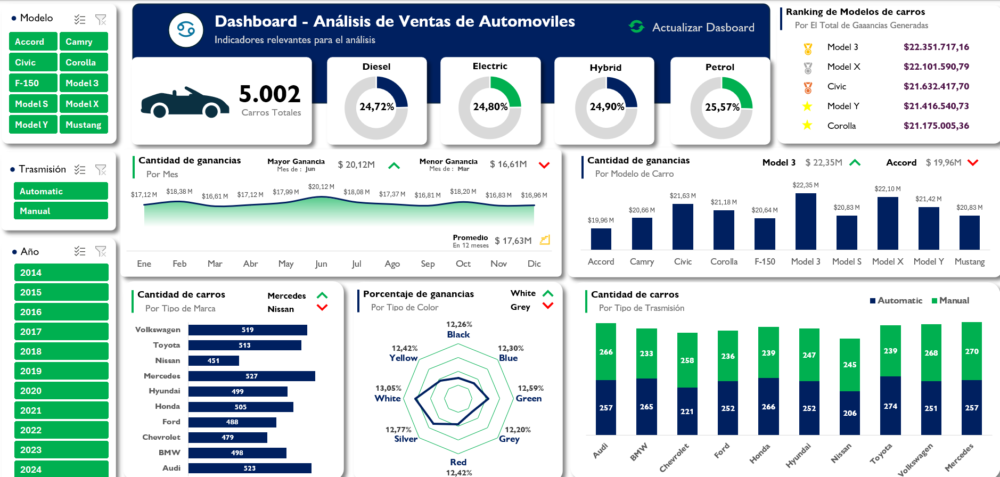
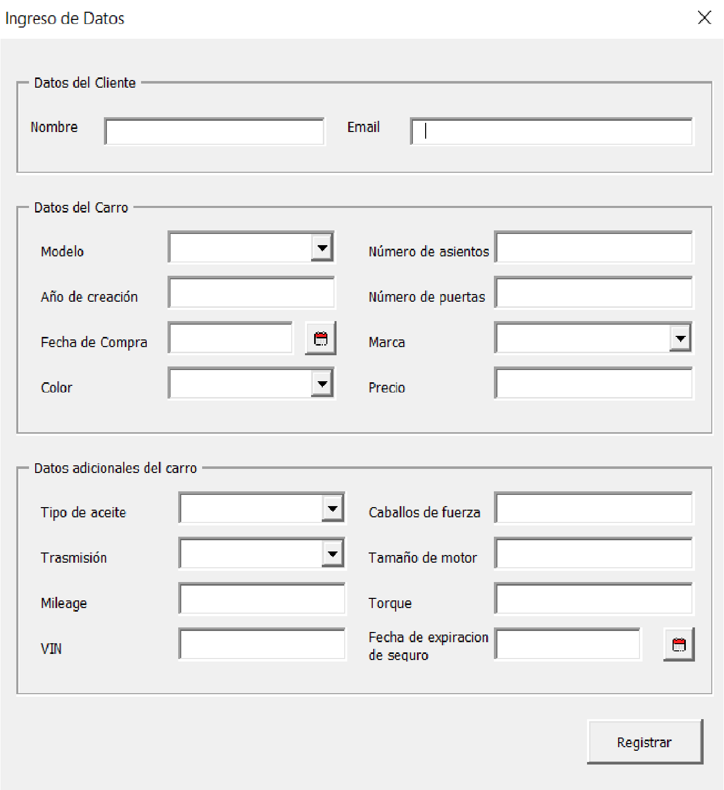
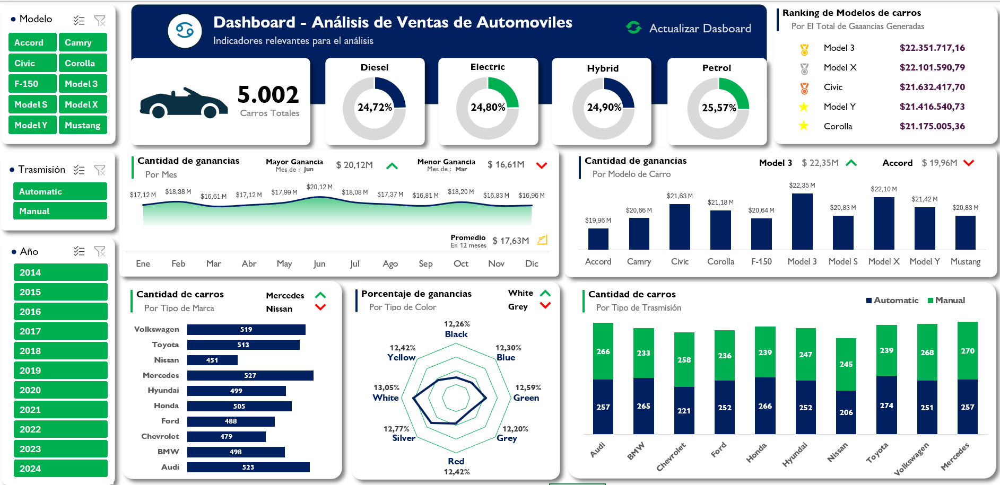
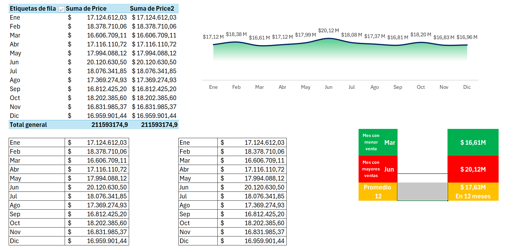
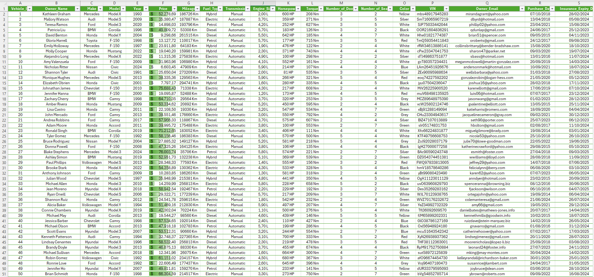

# **🚗 AutoSelect**

### **Descripción del Proyecto**
Este proyecto es una herramienta de análisis y visualización de datos para la gestión de ventas de automóviles usados. Utiliza un dataset generado con la ayuda de ChatGPT que contiene información detallada sobre diversos vehículos, permitiendo un análisis exhaustivo mediante un dashboard interactivo.

### **Características Principales**
- **Dashboard Interactivo**: Filtra y visualiza los datos de ventas por modelo, tipo de transmisión y año de fabricación.
- **Base de Datos de Automóviles**: Contiene información detallada como el precio, kilometraje, tamaño del motor, tipo de combustible, y más.
- **Automatización del Ingreso de Datos**: El `Vehicle Id` se genera automáticamente contando las filas para asegurar la unicidad.
- **Cálculos Auxiliares**: Tablas auxiliares que facilitan la obtención de métricas clave y permiten la generación de gráficos y reportes.
- **Formulario de Ingreso de Datos**: Permite la entrada estructurada y validada de información de vehículos.

    

### **Estructura del Proyecto**
- **menu**: Permite ingresar datos y desplazarse a través de todas las hojas del archivo.

    

- **dashboard**: Contiene gráficos interactivos para el análisis de los datos.

    

- **tablas_auxiliar**: Incluye cálculos intermedios que alimentan el dashboard.

    

- **dataset_vehicle**: Almacena los datos de los vehículos.

    

- **lista_validacion**: Administra las listas de validación para asegurar la consistencia de los datos.
- **preguntas**: Plantea preguntas complejas respecto a la base de datos para su análisis.
- **respuestas**: Contiene las respuestas a las preguntas planteadas, utilizando funciones avanzadas de Excel.
- **dataset_original**: La base de datos original sin procesar.

### **Consideraciones para el Llenado de Datos**
- **Vehicle Id**: Se llena automáticamente (integer).
- **Owner_Name**: Nombre del propietario (string).
- **Make**: Marca del vehículo (string).
- **Model**: Modelo del vehículo (string).
- **Year**: Año de fabricación (integer).
- **Price**: Precio del vehículo (doble).
- **Mileage**: Kilometraje (long).
- **Fuel_Type**: Tipo de combustible (string).
- **Transmission**: Tipo de transmisión (string).
- **Engine_Size**: Tamaño del motor en litros (doble).
- **Horsepower**: Potencia en caballos de fuerza (integer).
- **Torque**: Torque en Nm (integer).
- **Number_of_Door**: Número de puertas (integer).
- **Number_of_Seat**: Número de asientos (integer).
- **Color**: Color del vehículo (string).
- **VIN**: Número de identificación del vehículo (general).
- **Owner_Email**: Correo electrónico del propietario (string).
- **Pucharse_Date**: Fecha de compra (date).
- **Insurance_Expiry_Date**: Fecha de expiración del seguro (date).

### **Requisitos**
- Excel (Microsoft Office 2019).
- Conocimientos básicos de manejo de hojas de cálculo y funciones avanzadas de Excel.

### **Autor**
    🍀 Deyvid Joseph Guevara Cueva